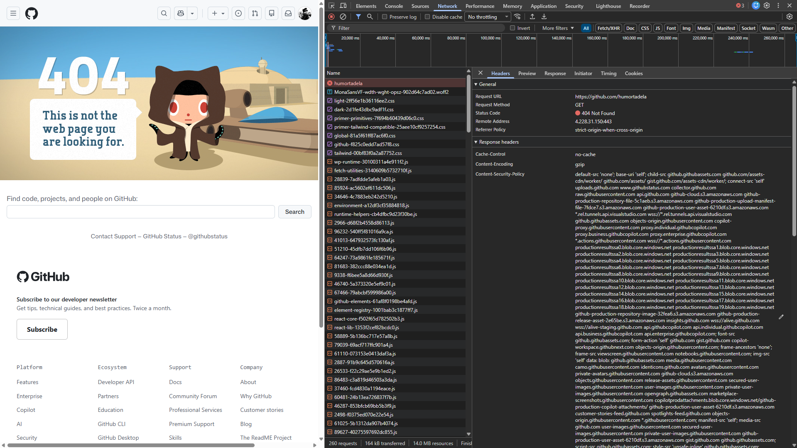

# Exercício Prático – Análise de Protocolos

**Disciplina:** Introdução à Computação  
**Aula:** 12  
**Data:** 04/05/2026  
**Integrante:** Adriano Lisarb Guzman Moura Batista  
**Grupo:** Individual

---

**Ferramenta utilizada:** Inspetor do Navegador (F12) — Google Chrome  
**Site analisado:** https://github.com/humortadela

O Humortadela foi um dos sites de humor mais populares do Brasil, ativo de 1995 até 2016. A URL aponta para uma organização inexistente no GitHub, gerando um **404 Not Found** didático.

---

## Request

| Campo | Valor |
|---|---|
| URL | https://github.com/humortadela |
| Método | GET |
| Protocolo | HTTP/2 (HTTPS) |

## Response

| Campo | Valor |
|---|---|
| Status Code | **404 Not Found** |
| Content-Type | text/plain; charset=utf-8 |
| Server | github.com |
| Cache-Control | no-cache |

---

## Status Code

**404 Not Found** — O servidor do GitHub respondeu normalmente, mas o recurso `/humortadela` não existe. Isso mostra que 404 não significa "site fora do ar", e sim que o servidor está ativo mas não encontrou o que foi solicitado.

---

## Protocolos Identificados

**TCP/IP** — Base de toda a comunicação. Dividiu os dados em pacotes e garantiu que chegassem íntegros ao destino.

**HTTPS** — O site usou HTTP/2 com criptografia TLS, confirmado pelo cadeado no navegador. Os dados trafegaram de forma segura mesmo com a resposta sendo um erro 404.

**DNS** — Antes da requisição, o navegador traduziu `github.com` para um endereço IP automaticamente. Sem isso, a requisição não chegaria ao servidor.

**FTP** — Não apareceu nessa análise. Seria utilizado para transferência direta de arquivos entre cliente e servidor, não para navegação web.

---

## Conclusão

O acesso a `https://github.com/humortadela` percorreu o ciclo completo: DNS traduziu o domínio, TCP/IP estabeleceu a conexão, HTTPS criptografou a comunicação e o servidor retornou 404 Not Found. O protocolo mais essencial foi o **TCP/IP**, pois é a base que sustenta todos os outros.

---

## Referências

UNIVERSIDADE FEDERAL DO RIO GRANDE DO NORTE (UFRN). Instituto Metrópole Digital. Disponível em: https://materialpublic.imd.ufrn.br/curso/disciplina/4/21/5. Acesso em: 4 maio 2026.

KUROSE, J. F.; ROSS, K. W. **Redes de computadores e a internet**. 5. ed. São Paulo: Addison Wesley, 2010.

TANENBAUM, Andrew S. **Redes de computadores**. 4. ed. Rio de Janeiro: Elsevier, 2003.

SOARES, L. F. G. **Redes de computadores das LANs, MANs e WANs às redes ATM**. 2. ed. São Paulo: Campus, 1995.

FOROUZAN, B. **Comunicação de Dados e Redes de Computadores**. 3. ed. Porto Alegre: Bookman, 2006.

40 maps that explain the internet. Vox. Disponível em: https://www.vox.com/a/internet-maps.
